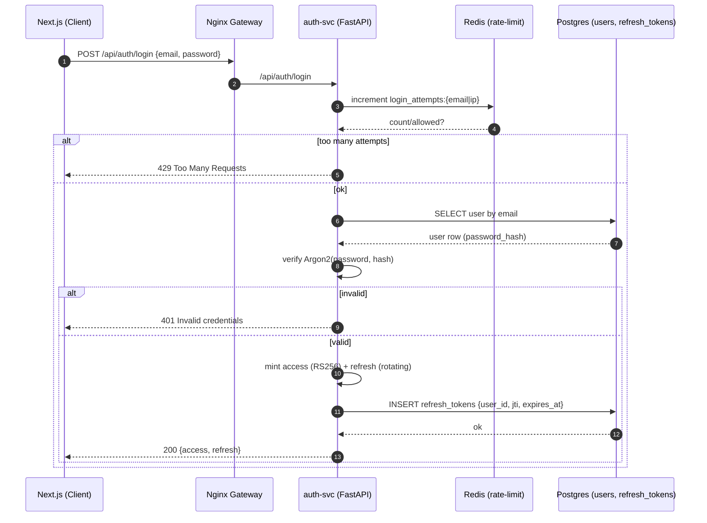
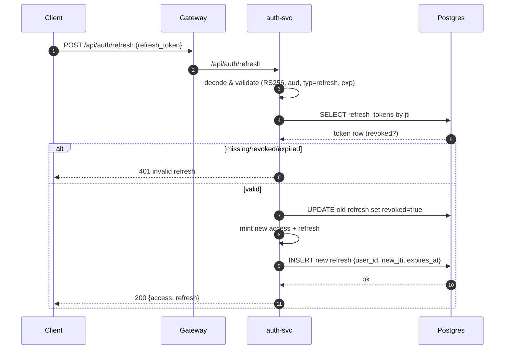
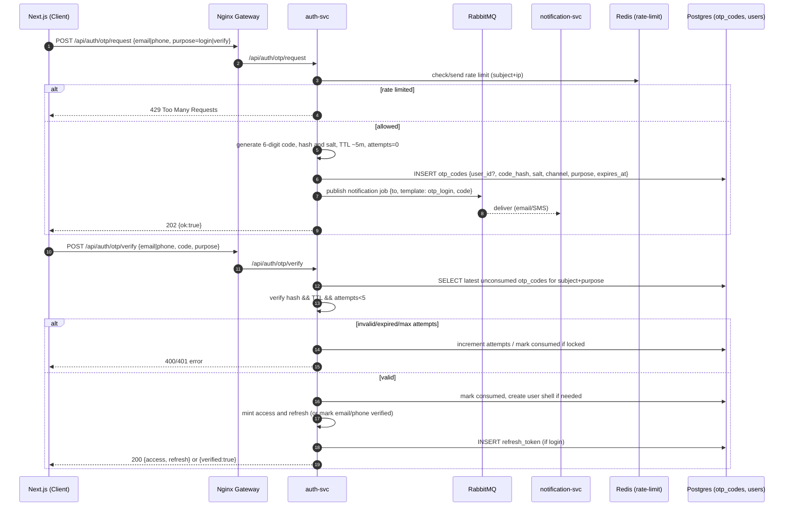
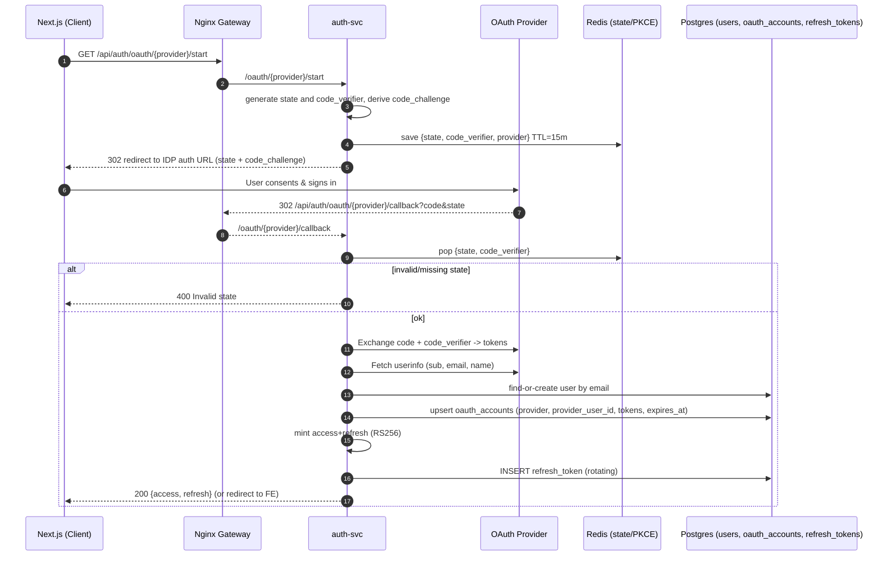
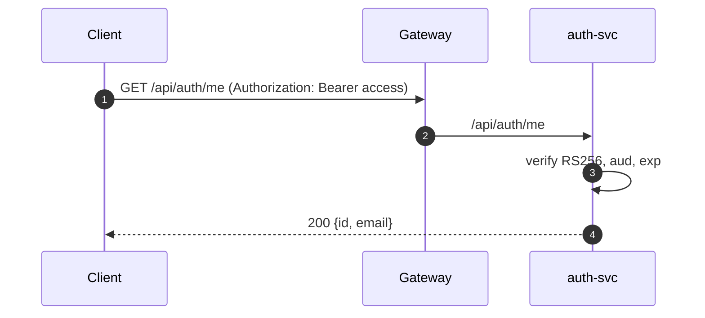
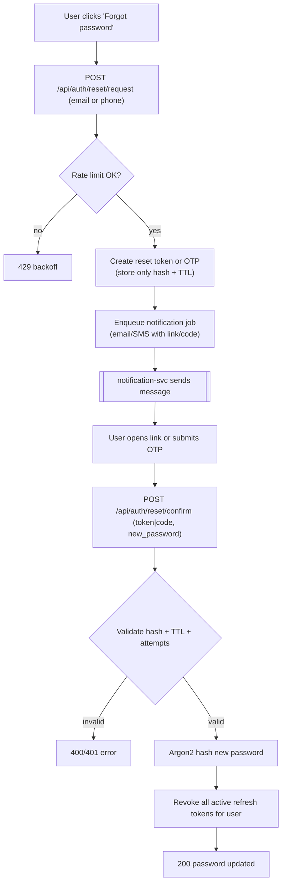

# Prepeet Authentication & Notification System Documentation

## Overview

The Prepeet authentication system is designed to provide flexible, secure, and scalable identity management. It supports multiple authentication methods — including traditional email/password, passwordless (magic link), one-time passcodes (OTP), and OAuth-based social login — all under a unified architecture built with **FastAPI**, **Redis**, **PostgreSQL**, **RabbitMQ**, and **Docker/Kubernetes**.

All methods share a consistent token issuance and refresh mechanism based on **JWT (RS256)** and rely on a dedicated **Notification Service** for message delivery (email/SMS/push).

---

## 🔑 Supported Authentication Methods

### 1. Email + Password (Argon2)

- Traditional authentication using Argon2 password hashing.
- Short-lived JWT access token and rotating refresh tokens.
- Enforced rate limiting via Redis.
- Supports password reset via OTP or magic link.

### 2. Magic Link (Passwordless Login)

- One-time, time-boxed login link sent via email or SMS.
- Each link is single-use, verified by a hash, and expires within 10–15 minutes.
- Eliminates password management while maintaining strong security guarantees.

### 3. One-Time Passcode (OTP)

- 6-digit numeric code sent via email or SMS.
- Stored as a hash (never plaintext) with a short TTL (typically 5 minutes).
- Supports login, account verification, and password reset.
- Rate limited (e.g., 5 sends per 15 minutes per user/IP).

### 4. OAuth (Social Login)

- Secure OAuth 2.0 Authorization Code + PKCE flow.
- Supported providers: **Google**, **GitHub** (extensible for others).
- Stateless, CSRF-protected using **state** and **nonce** validation.
- Supports account linking for existing users.

### 5. (Optional) Advanced Authentication

- **TOTP** (authenticator apps such as Google Authenticator or Authy).
- **WebAuthn/Passkeys** for biometric or hardware-backed credentials.

---

## 🧩 Service Architecture

| Service              | Description                                                                                      |
| -------------------- | ------------------------------------------------------------------------------------------------ |
| **auth-svc**         | Identity store, token management, credential verification, refresh logic, and session policies.  |
| **notification-svc** | Provider-agnostic message delivery (Email/SMS/push), templating, and rate limiting via RabbitMQ. |
| **user-svc**         | Manages user profiles, connected accounts, and linked OAuth identities.                          |

---

## 🗄️ Data Model (auth DB)

| Table            | Description                                                                |
| ---------------- | -------------------------------------------------------------------------- |
| `users`          | Primary identity store (email, phone, password hash, verification status). |
| `refresh_tokens` | Stores refresh token metadata (jti, expiry, revoked).                      |
| `magic_links`    | Stores magic link hashes, channel type, and expiry.                        |
| `otp_codes`      | Stores hashed OTPs with TTL, attempts, and channel metadata.               |
| `oauth_accounts` | Stores linked OAuth provider data (provider_user_id, tokens, expiry).      |
| `login_attempts` | Tracks login attempts for rate limiting and lockout policies.              |

### Indexes

- `(email)`, `(phone)`, `(token_hash)`, `(code_hash)`, `(expires_at)`
- Enforces unique provider-user relationships across OAuth accounts.

---

## 🔐 Security and Rate Limiting

- **Argon2** password hashing for maximum security.
- **JWT Access Tokens**: short-lived (~15 min).
- **JWT Refresh Tokens**: long-lived (14 days, rotating, revocable).
- **Magic Links**: single-use, stored as hash, TTL 10–15 minutes.
- **OTP Codes**: stored as hash, TTL 5 minutes, max 5 attempts.
- **Replay/CSRF Protection**: state, nonce, and one-time tokens enforced.
- **Rate Limiting**: Redis token bucket or exponential backoff.
- **PII Protection**: all phone numbers normalized to E.164, sensitive data masked in logs.

---

## 🔗 Auth Service API Endpoints

### Password-Based Authentication

| Endpoint                       | Description                             |
| ------------------------------ | --------------------------------------- |
| `POST /api/auth/register`      | Registers a user (email + password).    |
| `POST /api/auth/login`         | Logs in with email/password.            |
| `POST /api/auth/reset/request` | Sends reset OTP or magic link.          |
| `POST /api/auth/reset/confirm` | Confirms password reset (token or OTP). |

### Magic Link

| Endpoint                       | Description                       |
| ------------------------------ | --------------------------------- |
| `POST /api/auth/magic/request` | Requests a one-time login link.   |
| `POST /api/auth/magic/consume` | Validates link and issues tokens. |

### OTP

| Endpoint                     | Description                                |
| ---------------------------- | ------------------------------------------ |
| `POST /api/auth/otp/request` | Requests an OTP for login or verification. |
| `POST /api/auth/otp/verify`  | Validates OTP and issues tokens.           |

### OAuth (Social Login)

| Endpoint                                  | Description                                  |
| ----------------------------------------- | -------------------------------------------- |
| `GET /api/auth/oauth/{provider}/start`    | Begins OAuth login (redirects to provider).  |
| `GET /api/auth/oauth/{provider}/callback` | Handles provider callback and issues tokens. |

### Common

| Endpoint                       | Description                                |
| ------------------------------ | ------------------------------------------ |
| `POST /api/auth/refresh`       | Rotates refresh tokens.                    |
| `GET /api/auth/me`             | Returns authenticated user profile.        |
| `GET /api/auth/jwks.json`      | Provides public keys for JWT verification. |
| `GET /healthz`, `GET /metrics` | Health and metrics endpoints.              |

---

## 📬 Notification Service (notification-svc)

### Responsibilities

- Send **Email** (SES/SendGrid) and **SMS** (Twilio/SNS).
- Provide templating for: `magic_link_login`, `otp_login`, `otp_verify`, `reset_password`.
- Enforce per-channel rate limiting (Redis-based).
- Support idempotency for duplicate prevention.
- Provide delivery tracking (bounce, invalid number).

### API (Internal)

| Endpoint                 | Description                        |
| ------------------------ | ---------------------------------- |
| `POST /api/notify/email` | Send templated email notification. |
| `POST /api/notify/sms`   | Send templated SMS notification.   |
| `POST /api/notify/test`  | Test endpoint for internal use.    |

### Message Queue Integration

Consumes from RabbitMQ queue **`notifications`**:

```json
{
  "type": "email|sms",
  "template": "magic_link_login",
  "to": "user@example.com",
  "data": { "link": "https://..." }
}
```

---

## 🧠 Flow Diagrams

### Email + Password Login



### Refresh Token Rotation



### Magic Link Flow



### OTP Flow


### OAuth (Google/GitHub) Flow



### Authenticated



### Password reset (request → email link/OTP → confirm)



---

## 🔒 Security Checklist

- ✅ Enforce HTTPS and secure cookies (HttpOnly, SameSite=strict).
- ✅ Use Argon2id hashing parameters tuned per hardware.
- ✅ JWTs signed using RS256 (rotating key pairs stored securely).
- ✅ All tokens validated with exp/aud/iss claims.
- ✅ Redis locks for rate limiting and OTP attempt tracking.
- ✅ Secure event logging (no plaintext secrets).
- ✅ Secrets loaded via AWS Secrets Manager or Vault.

---

## 🚀 Deployment Notes

- Docker Compose for local orchestration (auth + notification + db + mq).
- Kubernetes Helm charts for scalable deployment.
- Auto-scaling RabbitMQ consumers for burst load.
- TLS termination via NGINX or Caddy proxy.
- Configurable providers and templates via environment variables.
