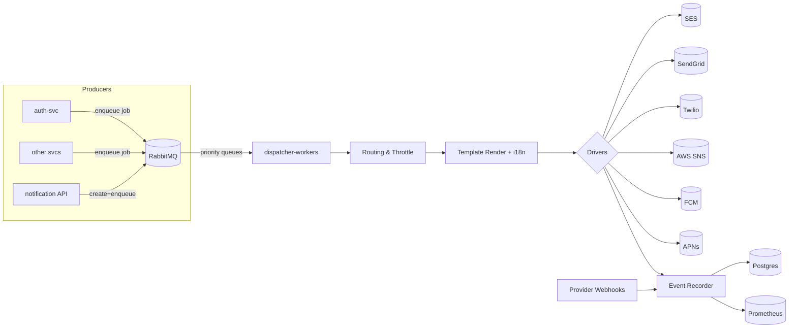
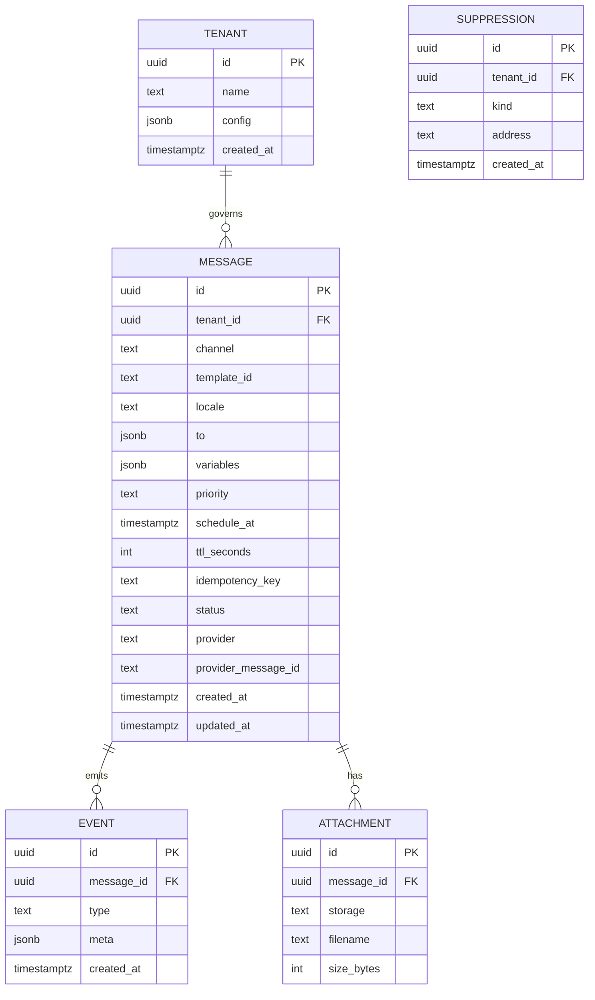

# Goals

Multi-channel (Email, SMS, Push, WhatsApp, in-app) with provider failover and smart routing.

Templates + localization + variables with versioning and preview.

Scheduling, throttling, priorities, retries, DLQ, and idempotency.

Delivery analytics (opens/clicks/bounces/DLR) + webhooks.

Multi-tenant quotas, budgets, and per-tenant rate limits.

Secure, auditable, and observable.

---

# Core concepts

## Message model (API/Queue payload)

```json
{
  "tenant_id": "t_001",
  "idempotency_key": "nl-2ce1...",
  "channel": "email|sms|push|whatsapp|inapp",
  "template_id": "otp_login:v3",
  "locale": "en-GB",
  "to": {
    "email": "user@x.com",
    "phone": "+447700900123",
    "device_token": null
  },
  "variables": { "code": "384921", "ttl": 5, "link": "https://..." },
  "attachments": [{ "s3": "s3://prepeet-bucket/receipts/r-123.pdf" }],
  "metadata": { "category": "auth", "tags": ["otp", "login"] },
  "priority": "high|normal|low",
  "schedule_at": "2025-10-29T20:45:00Z",
  "ttl_seconds": 900,
  "callback_url": "https://api.prepeet.ai/internal/notify/events",
  "trace_id": "9e2b4f..."
}
```

---

# Channels & default providers

- **Email:** AWS SES (primary), SendGrid (failover), console (dev)
- **SMS:** Twilio (primary), AWS SNS (failover), console (dev)
- **Push:** FCM (Android/Web), APNs (iOS)
- **WhatsApp:** Twilio WhatsApp / Meta Cloud API (optional)
- **In-app:** stored notifications + websocket broadcast (later)

---

# Feature set

## 1. Provider-agnostic drivers & smart routing

- Pluggable drivers per channel: `drivers/{email,sms,push}/{ses,sendgrid,twilio,sns,fcm,apns}.py`
- Failover policy: circuit breaker + exponential backoff; health-checked providers.
- Cost-aware routing: pick cheapest healthy provider by country/volume (configurable).
- Content-based routing: transactional (OTP) → highest reliability; marketing → cheapest.

## 2. Templates, i18n, versioning

- Jinja2 templates: `templates/<locale>/<template_id>.(html|txt|md)`
- Versioned: `otp_login:v1`, `:v2`, `:v3`
- Live preview endpoint with variable validation.
- Template partials (headers/footers), link helpers, short-link service for click tracking.

## 3. Scheduling, priorities, throttling

- Schedule future sends with a scheduler worker.
- Priorities via separate queues: `notifications.high`, `.normal`, `.low`.
- Tenant-level throttles and recipient-level dedupe.

## 4. Idempotency & dedupe

- Require `idempotency_key` on API; store hash in Redis.
- Outbox pattern: persist message before enqueue; track state transitions.

## 5. Retries & DLQ

- Exponential backoff retries (3 attempts at 10s/60s/5m).
- DLQ queues: `notifications.dlq.email`, `.sms`, etc.
- DLQ inspection and replay endpoints.

## 6. Delivery analytics & events

- Email: open/click tracking via pixel and redirect links.
- SMS: DLR (delivery receipts) via webhooks.
- Event bus: `NotificationSent`, `NotificationFailed`, etc.
- Persisted to `notification_events` table.

## 7. Multi-tenant governance

- Tenant config for feature flags, limits, budgets, preferences.
- Hard caps (429) + soft caps (warnings).
- Per-tenant unsubscribe link signing.

## 8. Compliance & content safety

- Unsubscribe flows, suppression lists, SPF/DKIM/DMARC, PII scrubbing.
- EU data residency and SMS compliance per region.

## 9. Observability & admin

- Prometheus metrics, structured logs, OpenTelemetry traces.
- Admin endpoints: health, provider status, queue stats, DLQ replay, template preview.

---

# High-level architecture (Mermaid)



---

# Data model (Postgres)



---

# API surface (notification-svc)

## Public/Internal

- `POST /api/notifications` → create + schedule
- `GET /api/notifications/{id}` → status + events
- `POST /api/preview` → render template with variables
- `POST /api/batch` → bulk enqueue
- `POST /api/shortlinks` → create tracked link

## Admin/Provider

- `GET /admin/healthz`, `GET /admin/providers`
- `GET /admin/queues`, `POST /admin/dlq/replay`
- `POST /webhooks/email/{provider}`, `POST /webhooks/sms/{provider}`

---

# Example: create notification

```bash
POST /api/notifications
Content-Type: application/json
Idempotency-Key: nl-2ce1...

{
  "tenant_id": "t_001",
  "channel": "email",
  "template_id": "magic_link_login:v2",
  "locale": "en-GB",
  "to": { "email": "user@x.com" },
  "variables": { "link": "https://..." },
  "priority": "high",
  "ttl_seconds": 900
}
```

**Response:**

```json
{ "message_id": "msg_9e2b4f", "status": "queued" }
```

---

# Workers & queues

- Queues: `notifications.high`, `notifications.normal`, `notifications.low`, plus `.dlq.*`
- Consumers: dispatcher, scheduler, analytics
- Retry policy with exponential backoff and jitter.

---

# Provider selection logic

```python
def choose_provider(channel, tenant, country):
    candidates = HEALTHY_PROVIDERS[channel]
    candidates = [p for p in candidates if p.name in tenant.config["providers"][channel]["allow"]]
    ranked = sorted(candidates, key=lambda p: score(p, country, channel))
    return ranked[0]
```

---

# Security & compliance

- Secrets in AWS Secrets Manager; IAM roles for SES/SNS/S3.
- Signed S3 URLs for attachments.
- HMAC-signed unsubscribe links.
- PII masking and scoped debug logging.
- JWT or mTLS for all endpoints.

---

# Metrics

- `notifications_enqueued_total{channel,tenant}`
- `notifications_sent_total{channel,provider,tenant}`
- `notifications_failed_total{reason,provider}`
- `provider_circuit_open{provider}`
- `delivery_latency_ms_bucket`
- `open_rate{tenant,template_id}`, `click_rate{...}`

---

# Implementation plan

## Phase 1 (MVP transactional)

- Email (SES), SMS (Twilio)
- Templates + i18n
- Single queue, retries, DLQ, `/api/notifications`

## Phase 2

- Provider failover + circuit breaker
- Click tracking + webhooks + suppression list

## Phase 3

- Multi-tenant quotas
- Cost-aware routing
- In-app channel + dashboards
